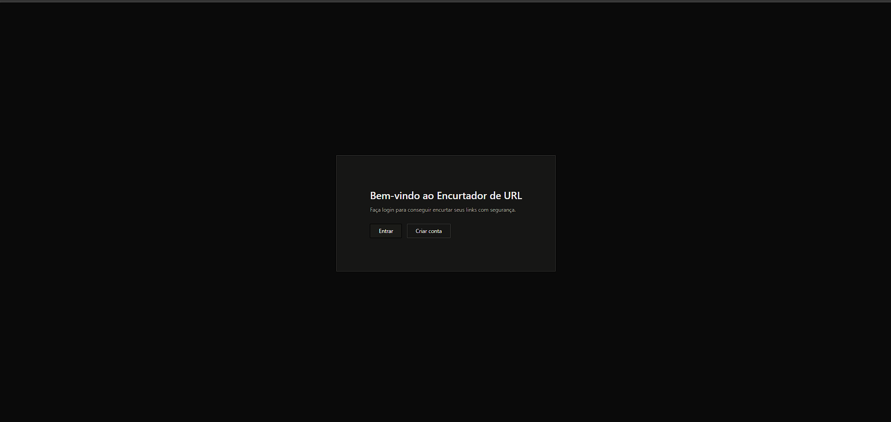
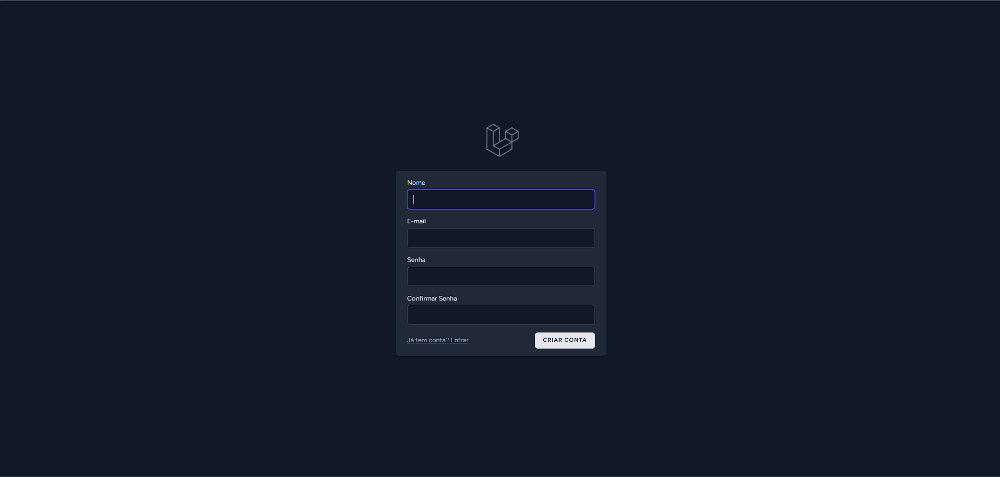
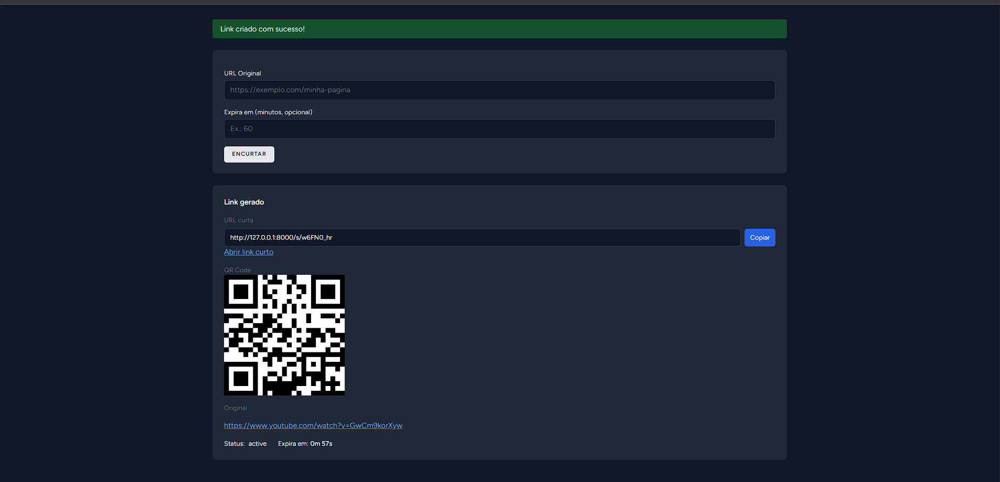
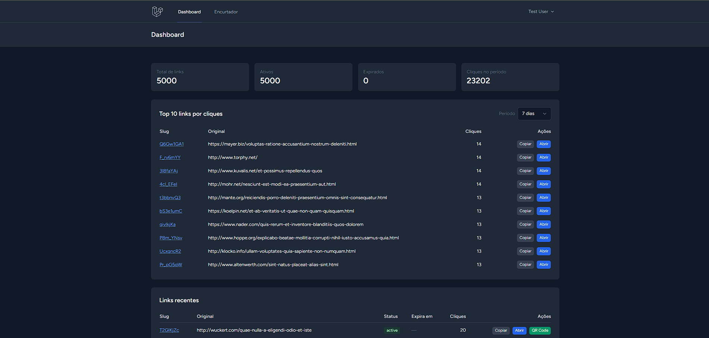

## Encurtador de URL com Dashboard (Laravel 12)

Aplicação web para encurtar URLs com expiração opcional, QR Code, redirecionamento com contagem de cliques e dashboard com métricas (resumo e top links por período). Inclui uma API JSON mínima para integração.

### Pré-visualizações

### Principais funcionalidades
- Criação de links curtos autenticada
- Expiração opcional por minutos
- Redirecionamento em `/s/{slug}` com registro de visita
- QR Code do link curto
- Dashboard com:
  - Resumo: total de links, ativos, expirados e cliques no período
  - Top links por cliques no período
- API JSON para listar/criar/consultar links

### Stack
- Laravel 12 (PHP 8.2+)
- SQLite por padrão (MySQL/PostgreSQL opcionais)
- Vite + TailwindCSS + Alpine.js
- Pest para testes

## Como rodar (Windows, macOS ou Linux)

### Requisitos
- PHP 8.2+
- Composer
- Node.js 18+
- MySql

### Passo a passo
1. Instalar dependências
   - `composer install`
   - `npm install`
2. Configurar ambiente
   - Copiar `.env.example` para `.env`
   - `php artisan key:generate`
3. Migrar tabelas
   - `php artisan migrate`
4. Subir aplicação
   - Backend: `php artisan serve`
   - Frontend: `npm run dev`

### Usuário de exemplo (seeding opcional e pesado)
O seeder pode gerar até 5.000 links e 100.000 visitas para demonstrar o dashboard. Use apenas se quiser muitos dados locais.
- `php artisan db:seed`
- Usuário padrão: email `test@example.com`, senha `password`

## Rotas principais

### Web
- `GET /` página inicial
- `GET /dashboard` dashboard (autenticado)
- `GET /links` lista e criação (autenticado)
- `POST /links` cria link curto (autenticado)
- `DELETE /links/{link}` remove link (autenticado)
- `POST /links/{link}/expire` força expiração se já passou do prazo (autenticado)
- `GET /links/{link}/qrcode` QR Code SVG (autenticado)
- `GET /s/{slug}` redireciona e registra visita

### API JSON
- `GET /api/links` paginação de links do usuário
- `POST /api/links` cria link curto
- `GET /api/links/{link}` detalhe de um link do usuário

### Métricas (API)
- `GET /metrics/summary?period={today|7d|30d|all}`
- `GET /metrics/top?period={today|7d|30d|all}`

Períodos aceitos: `today`, `7d`, `30d`, `all`.

## Testes
- `composer test`

## Configuração do banco
Por padrão, o projeto usa SQLite. Para usar MySQL ou PostgreSQL, ajuste as variáveis no `.env` e execute `php artisan migrate` novamente.

## Licença
MIT
